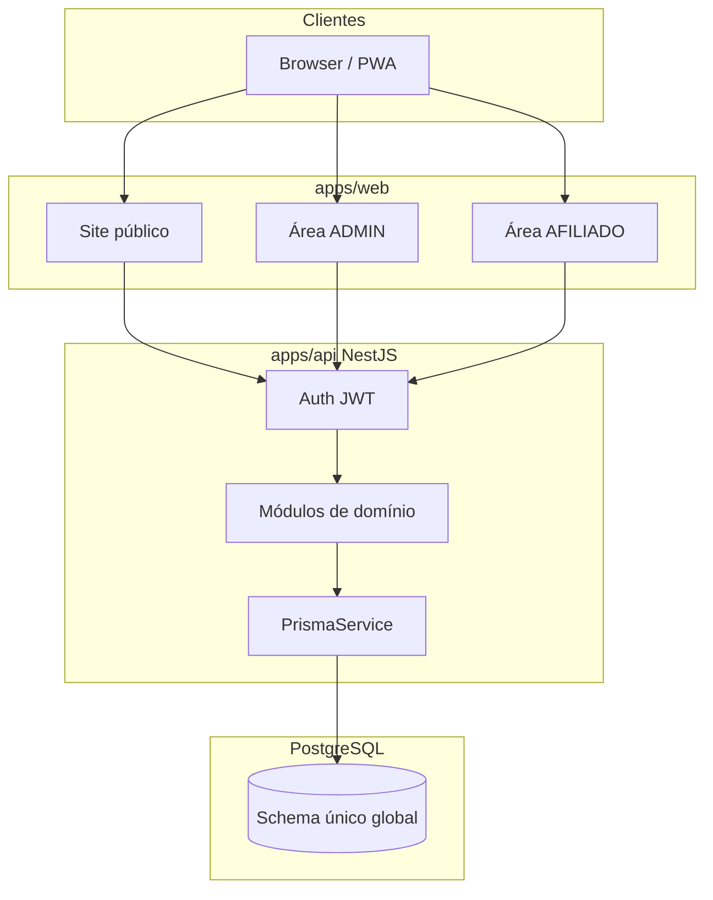
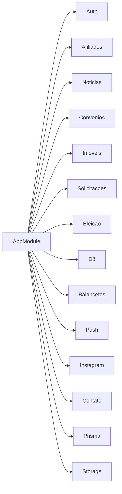
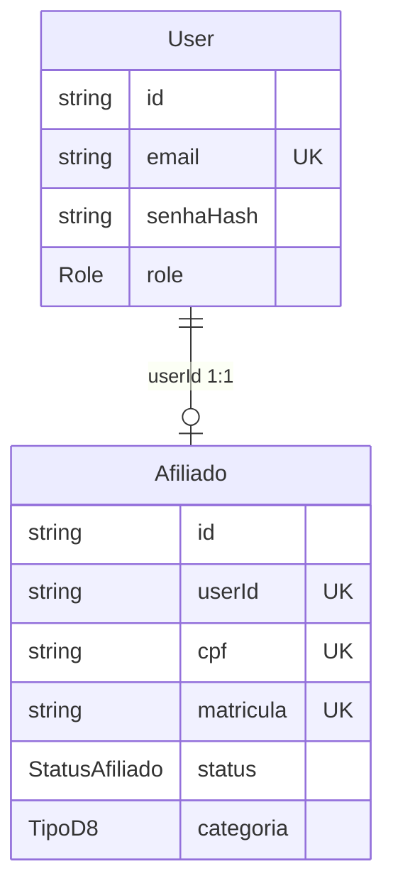
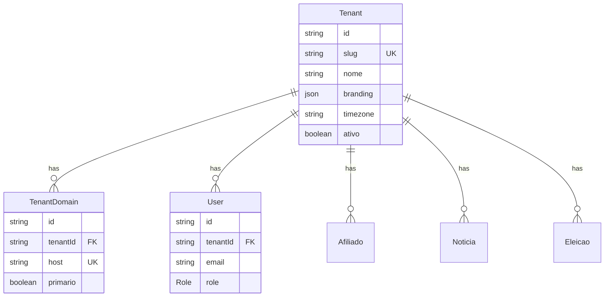
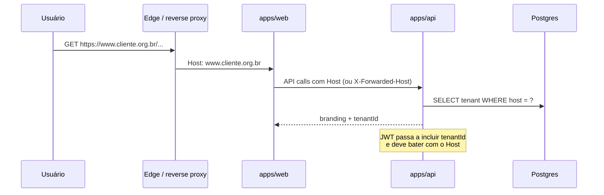

# Arquitetura — Sistema de Sindicatos

Documento de referência do estado atual e do caminho para multi-tenant.  
**Cliente atual (tenant zero):** SINDPRF-CE (Sindicato dos Policiais Rodoviários Federais no Estado do Ceará).

Última varredura: 2026-08-04.

---

## 1. Visão geral

O sistema é um monorepo **single-tenant**: um banco, um sindicato, uma marca, um admin global. Não existe `tenantId`, `orgId` nem scoping por organização em schema, JWT ou queries.



### Stack

| Camada | Tecnologia |
|--------|------------|
| Monorepo | npm workspaces (`apps/*`, `packages/*`), Node ≥ 20 |
| Web | React 18, Vite, React Router, TanStack Query, Zustand, Zod, RHF |
| API | NestJS 10, Prisma 6, PostgreSQL, JWT, Throttler, Schedule |
| Tipos | `@sindprf/types` — schemas Zod compartilhados (fonte única) |
| Config | `@sindprf/config` — ESLint, Prettier, tsconfig base |
| Infra | Docker Compose (dev/prod), Vercel (web; API opcional), Supabase ou Postgres |

> A regra em `.cursor/rules/architecture.mdc` ainda cita “pnpm”; o repositório usa **npm workspaces**.

---

## 2. Estrutura do monorepo

```
SistemaSindicatos/
├── apps/
│   ├── web/          # @sindprf/web — site + áreas autenticadas
│   └── api/          # @sindprf/api — Nest + Prisma
├── packages/
│   ├── types/        # @sindprf/types — Zod/DTOs
│   └── config/       # @sindprf/config — lint/format/tsconfig
├── docs/             # documentação (este arquivo)
├── scripts/          # helpers Docker / PWA
├── docker-compose.yml
├── docker-compose.dev.yml
└── package.json
```

### Convenções

- Domínio em português (`Afiliado`, `Eleicao`, `Convenio`); infra em inglês.
- Validação Zod em `@sindprf/types`, reusada no front e no back.
- Datas em UTC no banco; exibição tipicamente `America/Fortaleza` (hoje hardcoded no cliente atual).
- Features no front: `src/features/<feature>/{api,hooks,components,...}`.
- Backend: um módulo Nest por domínio.

---

## 3. Frontend (`apps/web`)

### Áreas de rota (`src/router.tsx`)

| Área | Prefixo | Proteção |
|------|---------|----------|
| Público | `/`, `/sobre`, `/diretoria`, `/contato`, `/noticias` | `PublicLayout` |
| Auth | `/login`, `/cadastro`, `/esqueci-senha`, `/redefinir-senha` | Sem role |
| Admin | `/admin/*` | `RequireRole('ADMIN')` |
| Afiliado | `/afiliado/*` | `RequireRole('AFILIADO')` |

### Features principais

| Feature | Responsabilidade |
|---------|------------------|
| `auth` | Login, store Zustand (`sindprf-auth`), guards |
| `afiliado` | Cadastro público + admin de afiliados |
| `noticias` | CMS público + admin |
| `convenios` | Benefícios (afiliado + admin) |
| `imoveis` / `solicitacoes` | Apartamentos e fila de locação |
| `eleicao` | Chapas, votação, apuração, comissão |
| `d8` / `financeiro` / `balancetes` | Importações SIAPE e balancetes |
| `push` / `pwa` | Web Push e instalação |
| `instagram` | Feed na home |

### Estado e HTTP

- **Cliente:** Zustand persistido (`accessToken`, `refreshToken`, `user`).
- **Servidor:** TanStack Query por feature.
- **HTTP:** Axios em `lib/http.ts` com refresh single-flight; base `VITE_API_URL`.

### Identidade visual (acoplada ao tenant atual)

Centralizada em `apps/web/src/lib/marca.ts` (nome, logo, sede, telefones, e-mail), mas também espalhada em:

- `lib/diretoria.ts`, `lib/filiacao.ts`
- Páginas institucionais, PWA (`vite.config.ts`), `index.html`
- PDFs e assets públicos (`/logo-sindicato.png`, `/filiacao/*`)

---

## 4. Backend (`apps/api`)

### Módulos Nest



| Módulo | Domínio |
|--------|---------|
| `auth` | Login (e-mail ou CPF), refresh, reset de senha |
| `afiliados` | Cadastro, status, senha admin |
| `noticias` | CMS + capa |
| `convenios` | Parceiros + declaração PDF |
| `imoveis` | Imóveis, fotos, períodos |
| `solicitacoes` | Pedidos de aluguel + mensagens |
| `eleicao` | Ciclo eleitoral completo |
| `d8` | Importação PDF SIAPE + sync de afiliados |
| `balancetes` | Importação balancete Fortes |
| `push` | Inscrições Web Push |
| `instagram` | Cache de feed |
| `contato` | Formulário → e-mail |
| `storage` | Uploads locais (`/uploads`) |

### Segurança transversal

- Guards globais: `JwtAuthGuard` + `RolesGuard`.
- `@Public()` para rotas abertas; `@Roles('ADMIN' | 'AFILIADO')`.
- `AfiliadoAprovadoGuard` em fluxos que exigem afiliado `APROVADO`.
- Throttling em auth/cadastro/contato.

### Auth (modelo atual)



- Roles: `ADMIN` | `AFILIADO` apenas.
- JWT payload: `{ sub: userId, role }` — **sem tenant**.
- Login: CPF → afiliado → user, ou e-mail → user.
- Admin seed: `admin@sindprf.local` / `Admin@123` (ou `SEED_ADMIN_SENHA`).

---

## 5. Modelo de dados (Prisma)

Arquivo: `apps/api/prisma/schema.prisma`.

### Grupos de entidades

| Grupo | Models |
|-------|--------|
| Identidade | `User`, `RefreshToken`, `PasswordResetToken`, `Afiliado` |
| Conteúdo | `Noticia`, `Convenio`, `InstagramPost` |
| Financeiro | `ImportacaoD8`, `LinhaD8`, `ImportacaoBalancete`, `LinhaBalancete` |
| Eleição | `Eleicao`, `Chapa`, `Candidato`, `Elegivel`, `Comparecimento`, `Voto`, `ResultadoApuracao`, `MembroComissaoEleitoral`, `ContestacaoChapa` |
| Imóveis | `Imovel`, `FotoImovel`, `Periodo`, `SolicitacaoAluguel`, `Mensagem` |
| Push | `PushSubscription` |

### Uniques globais (bloqueiam multi-tenant “ingênuo”)

| Model | Constraint |
|-------|------------|
| `User` | `email` |
| `Afiliado` | `cpf`, `matricula`, `userId` |
| `Noticia` | `slug` |
| `ImportacaoD8` | `(competenciaAno, competenciaMes, tipo)` |
| `ImportacaoBalancete` | `(competenciaAno, competenciaMes)` |
| `PushSubscription` | `endpoint` |
| `InstagramPost` | `externalId` |

Em multi-tenant, esses uniques precisam virar **compostos com `tenantId`** (ex.: `@@unique([tenantId, cpf])`).

### Nota de integridade eleitoral

- `Comparecimento` registra *que* o afiliado votou.
- `Voto` registra *em qual chapa*, **sem** `afiliadoId` (sigilo).
- Em multi-tenant, ambos os lados precisam do mesmo `tenantId`/`eleicaoId` já escopado.

---

## 6. Fluxos de negócio relevantes

### Cadastro e aprovação

1. Público em `/cadastro` → `User` + `Afiliado PENDENTE`.
2. Admin aprova → `APROVADO` → login liberado para área do afiliado.

### Importação D8 (SIAPE)

1. Admin envia PDF; texto extraído no browser (pdfjs).
2. API persiste competência + linhas; cria/atualiza afiliados; sincroniza status.
3. E-mails sintéticos: `d8.{cpf}@sindprf.local`.
4. Flag interna `substituirBase` (script) apaga **todos** os afiliados — inviável sem filtro de tenant.

### Eleição

Ciclo: preparação → chapas/homologação → elegíveis → votação → apuração.  
Elegíveis hoje = afiliados `APROVADO` do banco inteiro.

### Site público

CMS de notícias + conteúdo institucional estático (marca, diretoria, filiação). Não há CMS multi-brand.

---

## 7. Deploy e ambientes

| Ambiente | Como |
|----------|------|
| Dev local | `docker-compose.dev.yml` ou Postgres Docker + `npm run dev` |
| Prod VPS | `docker-compose.yml` (api + web; Postgres opcional / Supabase) |
| Vercel web | Root Directory `apps/web`, `VITE_API_URL` |
| Vercel API | Possível via `apps/api/vercel.json`, com limitações (uploads locais, cron) |

Prisma: `DATABASE_URL` (pooler) + `DIRECT_URL` (migrations); `binaryTargets` inclui `rhel-openssl-3.0.x`.

---

## 8. O que está acoplado ao SINDPRF-CE (inventário)

Para o sindicato virar “um cliente”, estes pontos precisam se tornar **dados do tenant** (ou config por tenant):

1. **Marca e conteúdo** — `marca.ts`, diretoria, filiação, textos de páginas, PWA, logos.
2. **Contato/e-mail** — destino SMTP, `VAPID_SUBJECT`, assinaturas de push/PDF.
3. **Timezone e localização** — hoje Fortaleza/CE implícito.
4. **Namespace de pacotes** — `@sindprf/*` e storage keys `sindprf-*` (renomear é cosmético; pode ficar como nome do produto).
5. **Seed/admin** — um admin global; e-mails `*@sindprf.local`.
6. **Integrações** — Instagram token, reserva externa `abre.ai`, regulamento PDF.
7. **Queries** — todas as listagens sem filtro de organização.

---

## 9. Decisões de produto (fechadas)

| # | Pergunta | Decisão |
|---|----------|---------|
| 1 | Identificação do tenant | **Domínio próprio do cliente** (ex.: `www.sindprfce.com.br`). O Host da requisição resolve o tenant. |
| 2 | Quem cria tenants | **Somente a Stellar** (`SUPERADMIN` da plataforma). Sem self-service / signup de sindicato. |
| 3 | Módulos por plano | **Tudo compartilhado por enquanto** — todo tenant recebe o mesmo conjunto de features (afiliados, notícias, convênios, imóveis, eleição, D8, balancetes, push, etc.). Sem feature flags por plano nesta etapa. |

O que *varia* por tenant (mesmo com módulos iguais): dados, branding, domínio, timezone, contato/SMTP e configs operacionais. Feature gating fica fora do escopo até nova decisão.

---

## 10. Alvo multi-tenant

### 10.1 Modelo: shared database + `tenantId` (row-level)

Adequado ao estágio atual (um produto, vários sindicatos no mesmo Postgres).



### 10.2 Resolução do tenant (domínio próprio)

Fluxo canônico — **não** usar seleção de sindicato no login nem path `/t/:slug` como eixo principal.



Regras:

1. Tabela `TenantDomain.host` (unique global) — um host → um tenant.
2. API resolve tenant pelo `Host` / `X-Forwarded-Host` em **toda** request (pública e autenticada).
3. JWT: `{ sub, role, tenantId }`. Se o token for de outro tenant que o Host, rejeitar (403).
4. `SUPERADMIN` Stellar acessa um **domínio/app da plataforma** (ex.: `admin.stellar...` ou host interno), não o site do cliente — ou entra via override explícito só nesse app.
5. CORS / cookies / PWA: permitir origins dos hosts cadastrados (lista dinâmica ou wildcard controlado).
6. TLS: certificado por domínio (wildcard da plataforma não cobre domínio do cliente) — Let’s Encrypt / Cloudflare / proxy com SAN.

Dev local: mapear hosts em `/etc/hosts` (`sindprf.local` → tenant seed) ou header `X-Tenant-Host` só em `NODE_ENV=development`.

### 10.3 Papéis

| Role | Escopo |
|------|--------|
| `SUPERADMIN` | Plataforma Stellar: CRUD de tenants, domínios, admin inicial do cliente. **Não** opera o dia a dia do sindicato pelo site do cliente. |
| `ADMIN` | Admin do sindicato (escopo = um `tenantId`). |
| `AFILIADO` | Membro do sindicato (escopo = um `tenantId`). |

### 10.4 O que muda no schema (mínimo)

1. Models `Tenant` + `TenantDomain` (+ JSON/config de branding).
2. `tenantId` obrigatório em **todas** as tabelas de negócio.
3. Uniques compostos `@@unique([tenantId, ...])` (e-mail, CPF, matrícula, slug, competências…).
4. JWT com `tenantId` + guard que confronta Host ↔ token.
5. Middleware Nest: resolve tenant → `Request` → Prisma extension / `withTenant`.
6. Front: bootstrap `GET /tenants/current` (pelo Host) para marca, logo, timezone, PWA name.
7. **Sem** tabela de planos/módulos nesta fase — todos os módulos Nest/features web ficam ativos para todo tenant.

### 10.5 Isolamento crítico

| Área | Risco se não escopar |
|------|----------------------|
| D8 / balancetes | Importação ou wipe cruza sindicatos |
| Eleição / voto | Vazamento de elegíveis ou apuração |
| Push | Notificação broadcast entre tenants |
| Admin listagens | Ver dados de outro cliente |
| Uploads | Paths `/uploads` sem prefixo de tenant |
| Domínio / CORS | Host errado servindo tenant errado |

### 10.6 Alternativas (quando considerar)

| Estratégia | Quando |
|------------|--------|
| Schema-per-tenant | Compliance forte / isolamento máximo; custo operacional alto |
| DB-per-tenant | Poucos clientes grandes; multiplica migrations/ops |
| **Shared DB + tenantId (escolhido)** | SaaS com N sindicatos, time pequeno |

---

## 11. Roadmap de migração (fases)

### Fase A — Fundação (SINDPRF-CE continua igual para o usuário)

1. Models `Tenant` + `TenantDomain` + seed `sindprf-ce` com host(s) atuais.
2. Coluna `tenantId` nullable → backfill → NOT NULL.
3. Uniques compostos.
4. Resolução por Host + JWT com `tenantId` + guard de consistência.
5. Prisma middleware/extension que força `where: { tenantId }` (e bloqueia create sem tenant).

### Fase B — Desacoplar marca e config

1. Mover `marca` / diretoria / filiação / PWA name para config do tenant (API + cache).
2. Logos e PDFs em `uploads/{tenantId}/...`.
3. SMTP / VAPID / timezone / e-mail de contato por tenant.
4. CORS e cookies alinhados aos hosts cadastrados.

### Fase C — Operação Stellar (multi-cliente)

1. App/painel `SUPERADMIN`: CRUD tenant, domínios, branding, admin inicial, ativo/inativo.
2. Runbook de onboarding: DNS do cliente (CNAME/A) → cadastro do host → TLS → smoke test.
3. Testes de isolamento (e2e: host A não lê dados do tenant B; JWT cruzado falha).
4. Revisar D8/`substituirBase`, push e seeds com filtro de tenant.

### Fase D — Escala (depois)

1. Rate limit / quotas por tenant (se necessário).
2. Observabilidade com `tenantId` + `host` em logs.
3. (Opcional) planos/feature flags — **só quando o produto pedir**.
4. (Opcional) schema/DB isolation para clientes enterprise.

---

## 12. Checklist “pronto para o 2º sindicato?”

- [ ] Toda query de negócio filtra `tenantId`
- [ ] Uniques compostos com `tenantId`
- [ ] Host resolve tenant; JWT carrega `tenantId` e bate com o Host
- [ ] Branding/timezone/e-mail vêm do tenant
- [ ] Uploads e PDFs prefixados por tenant
- [ ] D8/balancete/push/eleição isolados
- [ ] Seed: tenant SINDPRF-CE + domínio(s) + admin *desse* tenant
- [ ] Painel Stellar (`SUPERADMIN`) cria tenant + domínio + admin inicial
- [ ] DNS + TLS do domínio do cliente documentados no runbook
- [ ] Teste automatizado de isolamento entre dois hosts/tenants
- [ ] CORS permite apenas hosts cadastrados

---

## 13. Referências no repositório

| Artefato | Path |
|----------|------|
| Schema Prisma | `apps/api/prisma/schema.prisma` |
| App Nest | `apps/api/src/app.module.ts` |
| Router web | `apps/web/src/router.tsx` |
| Marca atual | `apps/web/src/lib/marca.ts` |
| Tipos compartilhados | `packages/types/src/` |
| Regra Cursor arquitetura | `.cursor/rules/architecture.mdc` |
| README operacional | `README.md` |
| Execução / ops | `execucao.md` |

---

## 14. Próximo passo de engenharia

**Fase A:** feita (tenantId, Host, JWT).  
**Fase B:** branding no `Tenant.branding` (marca, diretoria, filiação), host `sindigest` = tenant `PLATAFORMA` + role `SUPERADMIN`, site do cliente só em `sindprf…`, uploads em `uploads/{tenantId}/`, e-mail de contato lido do branding.

Ainda aberto / parcial: SMTP host ainda global (destino por tenant ok); VAPID keys ainda globais (subject/nome no push usam o tenant); PWA manifest estático no build.

**Fase C:** CRUD completo de tenants/domínios no painel Stellar.
